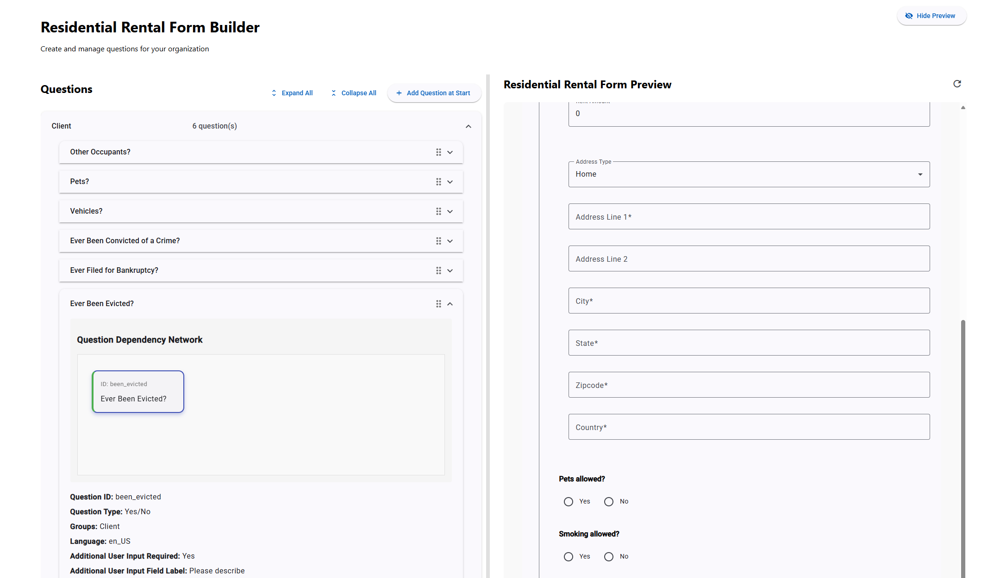
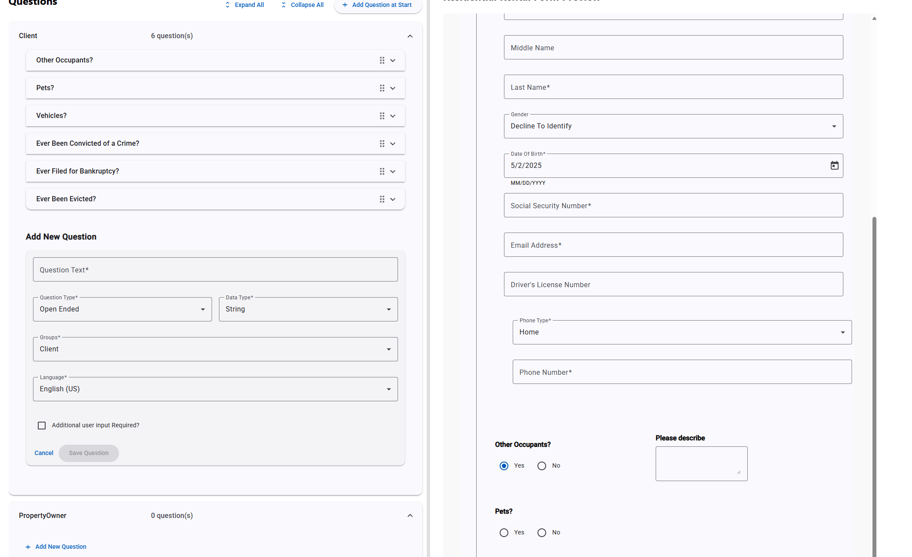
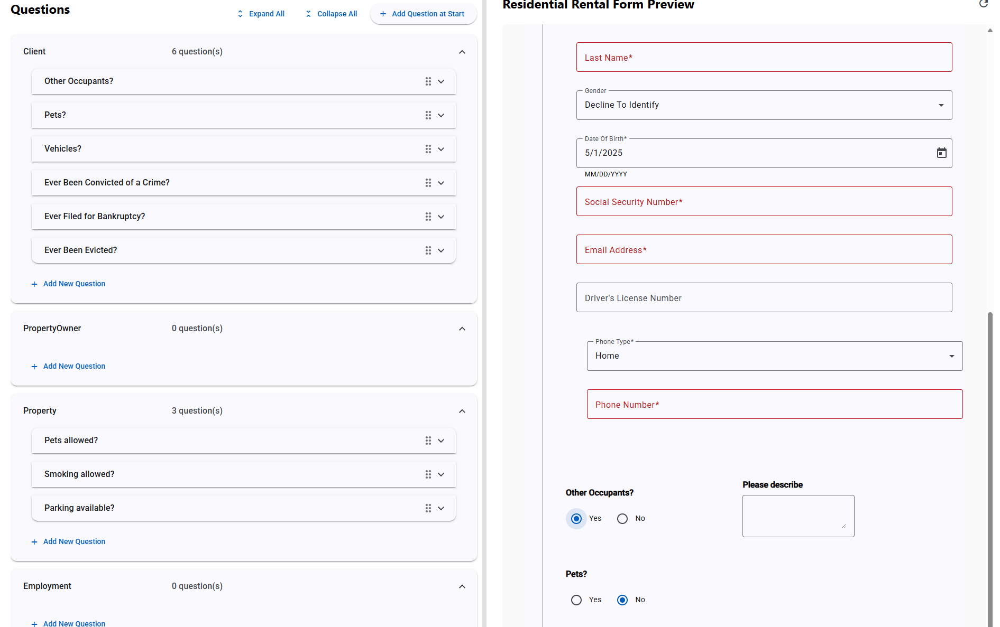

# Form Builder

A project for generating HTML forms and related code from OpenAPI specifications using a custom OpenAPI generator.

## Overview

Form Builder is a toolkit for automatically generating form-related code from OpenAPI specifications. It provides a streamlined workflow for creating consistent, validated forms across frontend and backend systems.

The project uses a custom OpenAPI generator to produce:
- TypeScript models
- Angular components and HTML templates
- Java backend code

## Demo

A demo of the Form Builder project is available at [Form Builder](https://bharatnj.github.io/fb/).

This approach ensures consistency between frontend and backend validation, reduces manual coding effort, and maintains a single source of truth in the OpenAPI specification.

## Project Structure

The project consists of the following modules:

### [forms-openapi](./forms-openapi/README.md)

This module contains the OpenAPI specifications that define the data models and API endpoints. These specifications serve as the source of truth for generating code.

Key features:
- Structured YAML files defining API schemas, paths, and components
- Support for tenant and client management APIs
- Reusable components for common data structures

### [forms-openapi-generator](./forms-openapi-generator/README.md)

This module contains custom code generators that extend the standard OpenAPI generator functionality. These generators produce code tailored to the platform's needs.

Key features:
- Custom Spring code generator for backend Java code
- Custom TypeScript Angular generator for frontend components
- Support for Firestore document models
- Custom Mustache templates and lambdas for code generation

### [forms-web](./forms-web/README.md)

This module contains the Angular web application that provides a user interface for creating and managing forms.

Key features:
- Questionnaire Builder for creating and configuring custom forms
- Real-time form preview functionality
- Drag-and-drop interface for organizing questions
- Support for various question types and validation rules
- Conditional questions based on previous answers

The Questionnaire Builder interface includes:





## Getting Started

To use this project, you'll need:
- Java 23
- Maven 3.x
- Node.js and npm (for Angular components)

### Building the Project

```bash
mvn clean install
```

### Generating Code

To generate code from the OpenAPI specifications, use the Maven build process or the OpenAPI Generator CLI with the custom generators.

## License

This project is licensed under a proprietary license owned by Spectrayan. The code is provided for demonstration purposes only and cannot be replicated or used for any other purpose without explicit permission.

See the [LICENSE](./LICENSE) file for full details.

## Development Guidelines

### Commit Strategy

This project follows an incremental commit strategy organized by module and functionality. Please refer to the [Commit Strategy](./COMMIT_STRATEGY.md) document for detailed guidelines on how to structure your commits and write meaningful commit messages.

A commit message template is available in [commit-template.txt](./commit-template.txt). You can configure Git to use this template with:

```bash
git config --local commit.template commit-template.txt
```

For an interactive experience with intelligent suggestions, you can use the commit helper script:

```powershell
.\commit-helper.ps1
```

This PowerShell script analyzes your staged files to:
- Identify which module the changes belong to
- Suggest appropriate feature/component categories
- Generate detailed descriptions based on file changes

The script guides you through creating a well-structured commit message while providing smart suggestions based on your actual code changes. You can accept the suggestions or override them with your own input.

## Contact

For questions or support, contact bharatnj@outlook.com
